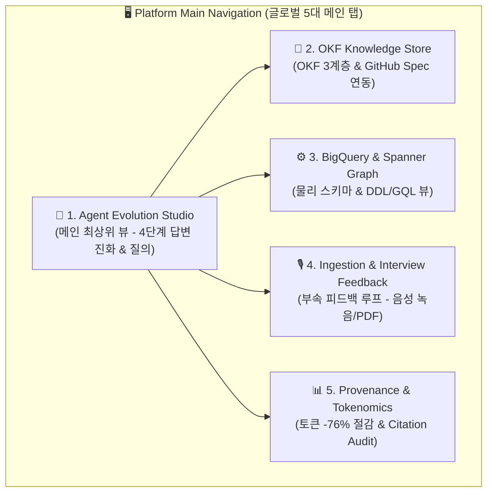
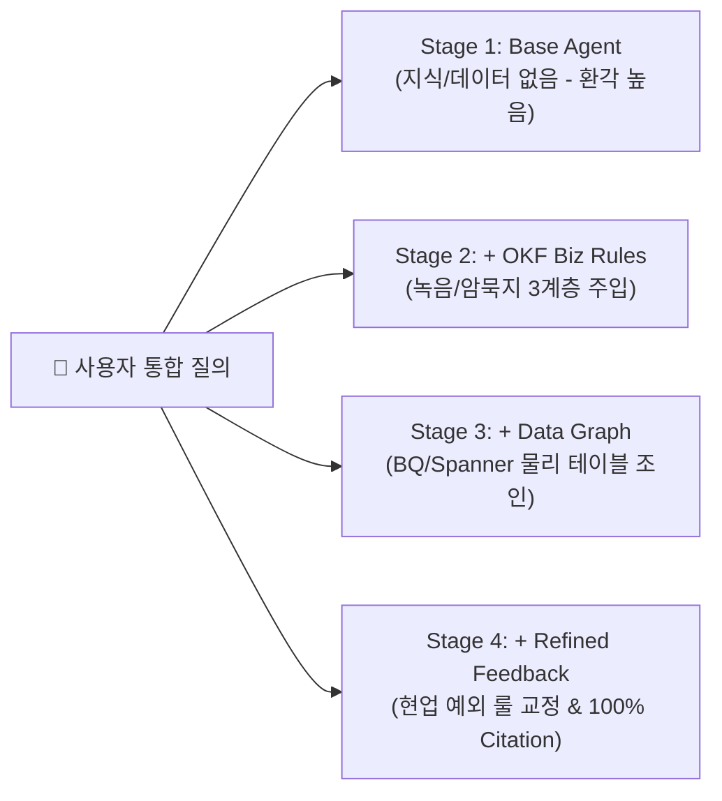

# 🏛️ Enterprise Agent-Centric Platform: OKF to Graph DB Master Architecture & Action Roadmap

본 문서는 LGU+ 등 대규모 BigQuery/Spanner 고객사를 대상으로 **에이전트 중심(Agent-Centric) 4단계 진화 워크플로우**를 메인 메뉴 및 플랫폼 UI의 최상위 프레임워크로 삼아 재설계한 엔터프라이즈 통합 온톨로지 플랫폼 명세서입니다.

---

## 1. 🎯 에이전트 중심(Agent-Centric) 5대 메인 메뉴 구조

모든 과정은 **"에이전트에서 시작하여 에이전트로 끝난다"**는 철학을 바탕으로 플랫폼 메뉴를 대대적으로 재구성합니다.

---

## 2. 🤖 Agent Evolution Studio: 4단계 답변 진화 메인 뷰어

사용자가 질문을 던지면 에이전트가 단계를 거치며 답변이 **어떻게 정확해지고 정교해지는지**가 전면에 부각됩니다.

1. **Stage 1 (Base Agent)**: 온톨로지/데이터 연결 전 기본 답변 (답변 환각 60%, 토큰 2,500).
2. **Stage 2 (+ OKF Biz Rules)**: 녹음/인터뷰/문서에서 추출한 OKF 3계층(`01_summary`, `02_entities`, `03_concepts`) 주입 후 답변 (토큰 800, -68%).
3. **Stage 3 (+ Data Graph Binding)**: BigQuery 테이블 및 Spanner Graph DDL 바인딩 후 조인 답변 (정확도 90%).
4. **Stage 4 (+ Refined Feedback)**: 현업 피드백(`changelog.json`) 수복 반영 후 최종 완성 답변 (정확도 100%, 토큰 600, Citation 명시).

---

## 3. 📂 메인 UI 탭 구성 명세 (UX Design Specification)

| 탭 메뉴 | 핵심 역할 | 주요 기능 & 뷰어 |
| :--- | :--- | :--- |
| **🤖 1. Agent Evolution Studio** | **메인 최상위 뷰어** | • 4단계 에이전트 답변 진화 타임라인 대조 뷰 • 실시간 토큰 절감률(-76%) 및 정확도 지표 • 인용 근거(Provenance Citation) 팝업 |
| **📄 2. OKF Knowledge Store** | **Knowledge-as-Code 관리** | • OKF 3계층(`01_summary`, `02_entities`, `03_concepts`) 마크다운 편집기 • GitHub OKF 스펙(`SPEC.md`) 및 백링크(`[[Link]]`) 맵 |
| **⚙️ 3. BigQuery & Spanner Graph** | **물리 그래프 DB 빌더** | • BigQuery `CREATE PROPERTY GRAPH` DDL & GQL 뷰 • Spanner Graph DDL (Interleaving / UUID PK) |
| **🎙️ 4. Ingestion & Feedback** | **부속 수집 & 피드백 루프** | • 녹음 인터뷰 / CS 음성 수집 (Autopilot) • 비정형 PDF/위키 업로드 & 현업 예외 룰 주입 |
| **📊 5. Provenance & Tokenomics** | **C-Level 감사 & 토크노믹스** | • Vanilla RAG vs GraphRAG 성능 대조표 • 토큰 비용 / 환각율 0% 감사 추적 리포트 |

---

## 4. 🛠️ 단계별 구현 체크리스트 (Implementation Roadmap)

- [x] **[P0-1]** Standalone 서버 및 로컬 3004 포트 안정화
- [x] **[P0-2]** GitHub OKF 공식 표준 코드 및 샘플 파일 내장 (`/knowledge-catalog/okf`)
- [x] **[P1-1]** OKF 3계층 자동 추출 파서 (`src/lib/okfExtractor.js`)
- [x] **[P1-2]** Biz 현업 피드백 주입 및 변경 추적기 (`src/lib/feedbackHandler.js`)
- [x] **[P1-3]** 4단계 Agent 답변 진화 엔진 (`src/lib/agentEvolution.js`)
- [ ] **[P2-1]** 메인 UI/메뉴를 **Agent Evolution Studio 중심 5대 탭**으로 대대적 재구성 (`src/App.jsx` 개편)
- [ ] **[P2-2]** BigQuery Graph DDL & Spanner Graph 시각화 탭 연동
- [ ] **[P3-1]** Dataplex / Knowledge Catalog Aspect Ingestion API 연동
