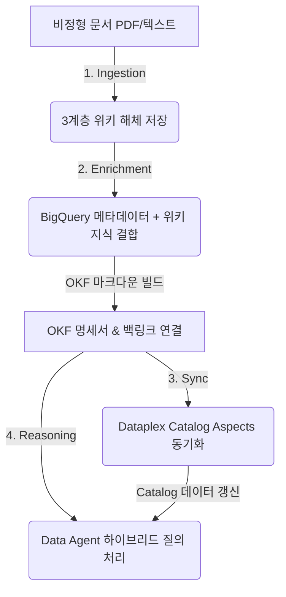

# OKF Omni: AI-Driven Enterprise Ontology Platform

**OKF Omni**는 엔터프라이즈의 데이터 메타데이터(BigQuery 스키마, DDL)와 비정형 비즈니스 지식(사내 가이드라인, 위키 문서, 정책 PDF)을 유기적으로 융합하여 상호 참조 온톨로지(Ontology)를 구축하고 지능형 데이터 분석을 지원하는 플랫폼입니다.

> 📚 **주요 가이드 바로가기 (Quick Links)**
> - 📘 **[사용자 가이드 (User Guide)](./docs/USER_GUIDE.md)**: 기능별 사용법 및 5단계 추론 Provenance 활용법
> - 🛠️ **[개발자 가이드 (Developer Guide)](./docs/DEVELOPER_GUIDE.md)**: 아키텍처 스택, API 명세, 로컬 실행 & Cloud Run 배포 가이드
> - 🎨 **[디자인 시스템 명세서](./Design.md)**: UI 디자인 철학, 글로벌 5대 탭 및 컬러 토큰
> - 🤖 **[Gemini AI 연동 스펙](./GEMINI.md)**: Gemini 3.5 Flash 모델 규격, 생각 흐름 파싱 & 방어적 프로그래밍 수칙

---

## 🧭 사용자 액션 및 데이터 흐름 (Workflow & Data Flow)

본 플랫폼은 비정형 지식을 수집하고, 이를 물리 스키마와 결합하여 데이터 카탈로그에 동기화하고, 최종적으로 지능형 대화(RAG)를 수행하기까지의 유기적인 엔드투엔드 파이프라인을 따릅니다.



### 1. 지식 축적 단계 (Knowledge Ingestion Flow)
* **사용자 액션**: 사내 가이드라인, 정책 문서, PDF 파일을 플랫폼에 업로드합니다.
* **데이터 흐름**: AI가 문서를 배경 요약(Summary), 개체/용어 사전(Entities), 비즈니스 규칙 명세(Concepts) 3가지 용도별 위키 문서로 자동 해체하여 GCS 지식베이스에 저장합니다.

### 2. 온톨로지 명세 빌드 단계 (Ontology Enrichment Flow)
* **사용자 액션**: 데이터셋 내 테이블들을 대상으로 OKF(Open Knowledge Format) 명세서 자동 생성을 실행합니다.
* **데이터 흐름**: BigQuery 물리 스키마 정보와 GCS 위키 지식베이스의 정책들을 융합하여 테이블 설명서(`.md`)를 자율 조립합니다. 이때 물리 외래키(RDB FK) 및 프로퍼티 그래프 에지(Graph Edge) 관계를 추적하여 상호 참조 백링크(`[[table.md]]`)를 이중으로 정의합니다.

### 3. 지식 카탈로그 동기화 단계 (Dataplex Catalog Sync Flow)
* **사용자 액션**: 보강이 완료된 로컬 OKF 지식을 확인하고 Dataplex Catalog로 동기화(Push)를 실행합니다.
* **데이터 흐름**: 로컬 OKF 마크다운 본문 및 YAML 메타데이터와 GCP Dataplex Catalog의 실제 정보를 실시간 비교(Diff)한 뒤, 테이블 설명(Description) 및 개요(Overview Aspect) 항목에 반영합니다.

### 4. 지능형 질문 & 답변 단계 (Agent Reasoning Flow)
* **사용자 액션**: 자연어로 비즈니스 통계나 데이터 관계 질문을 입력합니다.
* **데이터 흐름**: 질문 의도에 맞춰 하이브리드 실행 전략(Standard SQL, Graph GQL `GRAPH_TABLE`, Direct Wiki)을 실시간 판별하고, 병렬 데이터 조회를 수행한 뒤 5단계 추론 Provenance(질문 ➔ 전략 ➔ 백링크 ➔ 위키 본문 ➔ 답변)와 함께 최종 리포트를 합성하여 반환합니다.

---

## 📝 핵심 프롬프트의 역할 (Prompt Specifications)

각 비즈니스 흐름 단계에서 동작하는 프롬프트 명세서입니다. 모든 프롬프트 소스코드는 [agentPrompts.js](./prompts/agentPrompts.js)에서 단일 소스로 관리됩니다.

1. **지식 해체 프롬프트 (`getLlmWikiDecomposePrompt`)**
   * 비정형 문서에서 핵심 개념과 물리 테이블 매핑 용어를 분해하여 3계층 위키 문서 양식으로 분류 및 합성합니다.
2. **지식 보강 프롬프트 (`getEnrichmentPrompt`)**
   * 테이블 스키마 구조에 사내 위키 룰셋을 주입하여 컬럼 설명을 보강하고 테이블 간 이중 백링크 관계를 형성합니다.
3. **하이브리드 전략 판별 프롬프트 (`getSqlGenerationPrompt`)**
   * 자연어 질의를 분석하여 SQL 통계 및 GQL 관계 추적 쿼리를 병렬 도출하고, BigQuery 예약어 충돌 방지를 위한 백틱(`) 이스케이프 처리를 주입합니다.
4. **최종 리포트 합성 프롬프트 (`getFinalAnswerPrompt`)**
   * SQL 결과 레코드, GQL 그래프 관계 데이터, 그리고 GCS 위키 지식을 결합하여 검증 정보 인용구가 포함된 보고서를 한국어 또는 영어로 최종 편집합니다.

---

## 📂 리포지토리 구성 가이드 (Directory Index)

### 🖥️ Frontend Layer
* [src/App.jsx](./src/App.jsx) - 리액트 프론트엔드 어플리케이션. 8개 탭 상태 관리, Aspects Diff 및 5단계 추론Provenace 추적 뷰어 렌더링.
* [src/App.css](./src/App.css) - 다크 모드, Glassmorphism, 탭 및 리스트 트랜지션 애니메이션 스타일 정의.

### ⚙️ Orchestration Backend Layer
* [server.js](./server.js) - Express 백엔드 API 게이트웨이. BigQuery, GCS I/O 처리 및 AI 에이전트 다단계 실행 흐름 통제.
* [start_server.sh](./start_server.sh) - 백엔드 서버(Port 3003) 자동 재기동 감시 프로세스.
* [tools/gcpTools.js](./tools/gcpTools.js) - GCP Client SDK (BigQuery, GCS) 래퍼.

### 🤖 AI Core Layer
* [agents/geminiAgent.js](./agents/geminiAgent.js) - Gemini 3.5 Flash 호출 클라이언트(다중 인증 지원) 및 생각 흐름(`thought`) 수집 모듈. 로컬 Python Reference Agent 비동기 실행 위임.
* [prompts/agentPrompts.js](./prompts/agentPrompts.js) - AI 에이전트 프롬프트 템플릿 통합 관리소 (SSOT).

### 📖 Specifications & Guides
* [docs/USER_GUIDE.md](./docs/USER_GUIDE.md) - 플랫폼 사용 가이드 및 5단계 추론 Provenance 활용법.
* [docs/DEVELOPER_GUIDE.md](./docs/DEVELOPER_GUIDE.md) - 시스템 기술 아키텍처, API 명세 및 Cloud Run 배포 가이드.
* [Design.md](./Design.md) - UI 디자인 가이드 및 컬러 토큰.
* [GEMINI.md](./GEMINI.md) - AI 에이전트 연동 가이드라인, 언어 규칙, 데이터 타입 예외 처리 명세서.

---

## 🚀 로컬 실행 방법 (Port: 3003)

### 1. GCP 로그인 및 ADC 설정
BigQuery 및 GCS 연동을 위해 권한 부여가 필요합니다.
```bash
gcloud auth login
gcloud auth application-default login
```

### 2. 기동 명령
```bash
# 의존성 패키지 설치
npm install

# 프론트엔드 프로덕션 에셋 빌드
npm run build

# 백엔드 통합 API 서버 기동 (localhost:3003 접속)
node server.js
```
