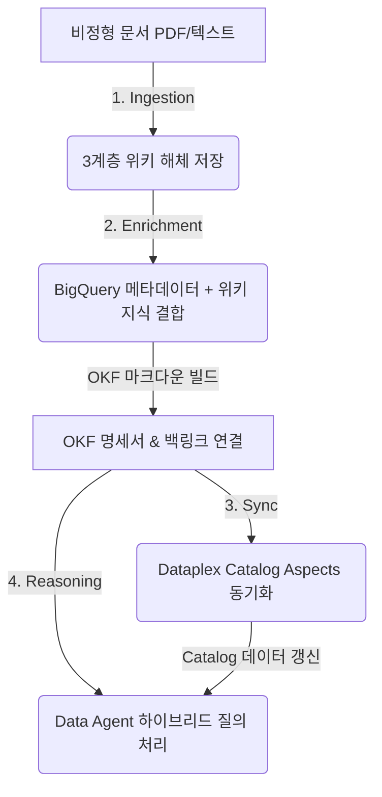

# 🌐 OKF Omni: AI-Driven Enterprise Ontology Platform

[](https://okf-omni-924723860007.us-central1.run.app/)
[](./GEMINI.md)
[](./docs/USER_GUIDE.md)

**OKF Omni**는 엔터프라이즈의 데이터 메타데이터(BigQuery 스키마, DDL)와 비정형 비즈니스 지식(사내 가이드라인, 위키 문서, 정책 PDF)을 유기적으로 융합하여 상호 참조 온톨로지(Ontology)를 구축하고 지능형 데이터 분석을 지원하는 플랫폼입니다.

---

## ⚡ 1-Click Live Demo 체험하기
아래 버튼을 클릭하면 Google Cloud Run 환경에 실시간으로 배포되어 동작하는 **OKF Omni 라이브 플랫폼**을 바로 체험하실 수 있습니다.

[](https://okf-omni-924723860007.us-central1.run.app/)

---

## 📚 주요 문서 & 가이드 바로가기 (Quick Navigation)

| 구분 | 문서 제목 | 상세 설명 |
| :--- | :--- | :--- |
| 📘 **사용자** | **[docs/USER_GUIDE.md](./docs/USER_GUIDE.md)** | 5대 메인 탭 활용법, 5단계 추론 Provenance 워크플로우 & FAQ |
| 🛠️ **개발자** | **[docs/DEVELOPER_GUIDE.md](./docs/DEVELOPER_GUIDE.md)** | 시스템 기술 스택, 백엔드 API 규격, 방어적 코드 수칙 & 배포 가이드 |
| 🎨 **디자인** | **[Design.md](./Design.md)** | UI 디자인 철학, 글로벌 5대 탭 및 디자인 토큰 |
| 🤖 **AI 스펙** | **[GEMINI.md](./GEMINI.md)** | Gemini 3.5 Flash 모델 사양, 생각 흐름(`thought`) 추출 & 용어 수칙 |
| 🏛️ **아키텍처**| **[docs/architecture/](./docs/architecture/)** | 전체 시스템 구성도 (`ARCHITECTURE_&_ROADMAP.md`) |
| 📋 **세부 스펙**| **[docs/specifications/](./docs/specifications/)** | 검증 체크리스트 및 백링크/LLM-Wiki 설계 제안서 |

---

## 🧭 사용자 액션 및 데이터 흐름 (Workflow & Data Flow)

본 플랫폼은 비정형 지식을 수집하고, 이를 물리 스키마와 결합하여 데이터 카탈로그에 동기화하고, 최종적으로 지능형 대화(RAG)를 수행하기까지의 유기적인 엔드투엔드 파이프라인을 따릅니다.



### 1. 지식 축적 단계 (Knowledge Ingestion Flow)
* **사용자 액션**: 사내 가이드라인, 정책 문서, PDF 파일을 플랫폼에 업로드합니다.
* **데이터 흐름**: AI가 문서를 배경 요약(Summary), 개체/용어 사전(Entities), 비즈니스 규칙 명세(Concepts) 3가지 용도별 위키 문서로 자동 해체하여 GCS 지식베이스에 저장합니다.

### 2. 온톨로지 명세 빌드 단계 (Ontology Enrichment Flow)
* **사용자 액션**: 데이터셋 내 테이블들을 대상으로 OKF(Open Knowledge Format) 명세서 자동 생성을 실행합니다.
* **데이터 흐름**: BigQuery 물리 스키마 정보와 GCS 위키 지식베이스의 정책들을 융합하여 테이블 설명서(`.md`)를 자율 조립합니다. 이때 물리 외래키(RDB FK) 및 프로퍼티 그래프 에지(Graph Edge) 관계를 추적하여 상호 참조 백링크(`[[table.md]]`)를 이중으로 정의합니다.

### 3. 지식 카탈로그 동기화 단계 (Dataplex Catalog Sync Flow)
* **사용자 액션**: 보강이 완료된 로컬 OKF 지식을 확인하고 Dataplex Catalog로 동기화(Push)를 실행합니다.
* **데이터 흐름**: 로컬 OKF 마크다운 본문 및 YAML 메타데이터와 GCP Dataplex Catalog의 실제 정보를 실시간 비교(Diff)한 뒤, 테이블 설명(Description) 및 개요(Overview Aspect) 항목에 반영합니다.

### 4. 지능형 질문 & 답변 단계 (Agent Reasoning Flow)
* **사용자 액션**: 자연어로 비즈니스 통계나 데이터 관계 질문을 입력합니다.
* **데이터 흐름**: 질문 의도에 맞춰 하이브리드 실행 전략(Standard SQL, Graph GQL `GRAPH_TABLE`, Direct Wiki)을 실시간 판별하고, 병렬 데이터 조회를 수행한 뒤 5단계 추론 Provenance(질문 ➔ 전략 ➔ 백링크 ➔ 위키 본문 ➔ 답변)와 함께 최종 리포트를 합성하여 반환합니다.

---

## 📝 핵심 프롬프트 소스 관리 (Single Source of Truth)

모든 AI 프롬프트 소스코드는 [prompts/agentPrompts.js](./prompts/agentPrompts.js)에서 단일 소스로 관리됩니다.

1. **지식 해체 프롬프트 (`getLlmWikiDecomposePrompt`)**: 비정형 문서에서 핵심 개념과 물리 테이블 매핑 용어를 분해하여 3계층 위키 양식으로 분류 및 합성합니다.
2. **지식 보강 프롬프트 (`getEnrichmentPrompt`)**: 테이블 스키마 구조에 사내 위키 룰셋을 주입하여 컬럼 설명을 보강하고 테이블 간 이중 백링크 관계를 형성합니다.
3. **하이브리드 전략 판별 프롬프트 (`getSqlGenerationPrompt`)**: 자연어 질의를 분석하여 SQL 통계 및 GQL 관계 추적 쿼리를 병렬 도출하고, 예약어 충돌 방지를 위한 백틱(`) 이스케이프 처리를 주입합니다.
4. **최종 리포트 합성 프롬프트 (`getFinalAnswerPrompt`)**: SQL 결과 레코드, GQL 그래프 관계 데이터, GCS 위키 지식을 결합하여 검증 정보 인용구가 포함된 보고서를 최종 편집합니다.

---

## 📂 리포지토리 구성 가이드 (Directory Index)

루트 디렉토리는 핵심 안내서 위주로 깔끔하게 구성되어 있으며, 세부 기능은 하위 디렉토리에서 확인하실 수 있습니다.

```
ontology-with-okf/
├── docs/                        # 📖 모든 플랫폼 상세 문서 및 가이드 모음
│   ├── USER_GUIDE.md            # 사용자 기능 사용 가이드 & FAQ
│   ├── DEVELOPER_GUIDE.md       # 개발자 시스템 기술 스택 & 배포 가이드
│   ├── architecture/            # 시스템 구성도 및 로드맵 문서
│   ├── specifications/          # 백링크/GQL 설계 제안서 및 검증 스펙
│   └── okf-templates/           # 사내 위키 템플릿 샘플 모음
├── src/                         # 🖥️ React 프론트엔드 어플리케이션 소스
├── agents/                      # 🤖 Gemini 3.5 Flash 호출 모듈 (geminiAgent.js)
├── prompts/                     # 📝 AI 프롬프트 단일 관리소 (agentPrompts.js)
├── tools/                       # ⚙️ GCP Client SDK (BigQuery, GCS) 래퍼 (gcpTools.js)
├── Design.md                    # 🎨 UI 디자인 시스템 명세서
├── GEMINI.md                    # 🤖 Gemini 연동 규격 & 방어적 프로그래밍 수칙
├── Dockerfile                   # 🐳 Cloud Run 배포용 Dockerfile
├── server.js                    # ⚙️ Express API 게이트웨이 백엔드 (Port 3003)
└── README.md                    # 🌐 최상단 개요 & Quick Links (본 문서)
```

---

## 🚀 로컬 실행 방법 (Port: 3003)

### 1. GCP 로그인 및 ADC 설정
```bash
gcloud auth login
gcloud auth application-default login
```

### 2. 기동 명령
```bash
# 의존성 패키지 설치
npm install

# 프론트엔드 프로덕션 에셋 빌드
npm run build

# 백엔드 통합 API 서버 기동 (http://localhost:3003 접속)
node server.js
```
