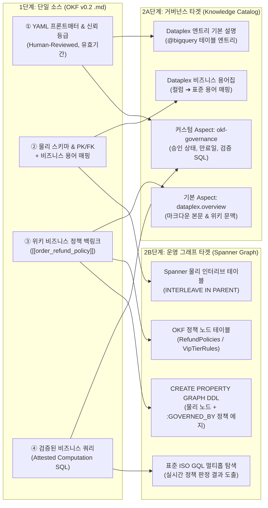

# 🕸️ OKF v0.2 ➔ Knowledge Catalog & Spanner Graph 쇼케이스 가이드

* **🇰🇷 한국어 쇼케이스 페이지**: [`http://localhost:3003/ko`](http://localhost:3003/ko)
* **🇺🇸 영문 쇼케이스 페이지**: [`http://localhost:3003/kc-spanner`](http://localhost:3003/kc-spanner)
* **🖥️ 메인 통합 스튜디오**: [`http://localhost:3003/`](http://localhost:3003/)

본 문서는 독립 쇼케이스 페이지(`/ko` 및 `/kc-spanner`)가 **어떤 비즈니스 문제 상황을 해결하는지**, 그리고 **화면의 각 단계가 무엇을 시연하는지** 설명하는 전용 가이드입니다.

---

## 1. 🎯 배경: 왜 이 데모가 필요한가? (비즈니스 문제 상황)

대부분의 기업에서는 **데이터(DB 스키마)**와 **업무 규칙(사내 위키·정책 문서)**이 서로 단절되어 있습니다.

1. **정형 데이터베이스(BigQuery / Spanner)의 한계**:
   * `orders`, `users`, `products` 같은 물리 테이블에는 `status`, `returned_at`, `stock_qty` 같은 컬럼만 존재할 뿐, **"어떤 고객에게 즉시 환불을 해주고, 어떤 경우 수동 심사로 넘기는지"**에 대한 비즈니스 정책 맥락이 없습니다.
2. **비정형 정책 문서(위키 / PDF 매뉴얼)의 한계**:
   * 사내 규정집에는 *"VIP Gold 고객은 30일 이내 반품 시 즉시 환불, 월 3회 초과 반품 계정은 수동 심사"*라고 적혀 있지만, 이 문서가 데이터 카탈로그나 운영 DB와 연결되어 있지 않습니다.
3. **결과적 문제**:
   * **데이터 거버넌스 측면**: 데이터 분석가나 스튜어드가 카탈로그(**Google Cloud Knowledge Catalog / Dataplex**)를 검색해도 해당 테이블에 어떤 현업 정책과 검증된 쿼리가 적용되는지 알 수 없습니다.
   * **실시간 운영/AI 추론 측면**: 운영 애플리케이션이나 AI 에이전트가 **Spanner Graph**를 탐색할 때 물리적인 외래키(FK) 관계만 볼 수 있을 뿐, 현업 정책(Policy)까지 결합된 멀티홉 의사결정을 내리지 못합니다.

---

## 2. 💡 핵심 해결책: OKF v0.2 단일 소스를 두 타겟으로 동시 컴파일

이 데모 페이지는 **Google Cloud Open Knowledge Format (OKF v0.2)** 마크다운 문서 하나를 **단일 진실 소스(Single Source of Truth)**로 삼아, **물리 스키마 + 비정형 비즈니스 정책 + 검증된 SQL**을 하나로 묶은 뒤 두 곳의 Google Cloud 타겟으로 동시에 주입(Feed)하는 아키텍처를 시연합니다.

---

## 3. 📦 시연 가능한 3가지 현업 비즈니스 시나리오

상단 시나리오 탭을 전환하면 각 도메인별로 OKF 문서가 어떻게 Knowledge Catalog와 Spanner Graph로 변환되는지 즉시 비교할 수 있습니다.

### 시나리오 ①: 📦 주문 & 환불 정책 (`orders` + `[[order_refund_policy]]`)
* **현업 상황**: 이커머스 고객이 반품(`status = 'Returned'`)을 접수했을 때, 상담원 개입 없이 **즉시 자동 환불(`INSTANT_REFUND`)** 처리할지, 악성 반품 의심 건으로 **수동 심사(`MANUAL_REVIEW`)**로 보낼지 판정해야 하는 상황.
* **OKF 결합 내용**:
  * **물리 스키마**: `orders` 테이블 (`order_id`, `user_id`, `status`, `returned_at`)
  * **위키 정책(`[[order_refund_policy]]`)**: *"VIP Gold 등급은 반품 후 30일 이내 즉시 환불 승인, 단 최근 30일 내 반품 3회 초과 계정은 수동 심사로 전환."*
* **양쪽 타겟 주입 결과**:
  * **Knowledge Catalog**: `@bigquery/.../tables/orders` 엔트리에 환불 정책 개요(`overview`), 스튜어드 승인 서명 및 검증 SQL(`okf-governance`), 컬럼별 용어(`결제 주문 고유번호` 등)가 등록됨.
  * **Spanner Graph**: 부모 `Users` 테이블과 인터리브된 `Orders` 테이블에 `RefundPolicy` 정책 노드가 `:GOVERNED_BY` 에지로 연결되며, ISO GQL 실행 시 고객별 등급·반품 횟수에 따라 `✅ 즉시 환불 승인` vs `⚠️ 수동 심사 전환`이 실시간 판정됨.

---

### 시나리오 ②: 👤 고객 & VIP 리텐션 규칙 (`users` + `[[vip_tier_rules]]`)
* **현업 상황**: 누적 구매액이 높은 핵심 VIP 고객이 일정 기간 주문을 하지 않을 때, 이탈(Churn)을 막기 위해 자동으로 맞춤형 리텐션 바우처를 발송해야 하는 CRM 마케팅 상황.
* **OKF 결합 내용**:
  * **물리 스키마**: `users` 테이블 (`id`, `email`, `ltv_amount`, `last_order_days`)
  * **위키 정책(`[[vip_tier_rules]]`)**: *"누적 구매액(LTV) $1,500 이상 고객은 VIP Gold 부여, 마지막 주문 후 45일 초과 시 $50 리텐션 바우처 자동 발송."*
* **양쪽 타겟 주입 결과**:
  * **Knowledge Catalog**: `users` 엔트리에 PII 마스킹 및 LTV/이탈 지표 용어집과 CRM 오너의 승인 내역(`human:crm-owner@enterprise.com`)이 동기화됨.
  * **Spanner Graph**: `(u:User)-[:GOVERNED_BY]->(r:VipTierRule)` 그래프 경로를 통해 LTV $1,500 이상이면서 45일 이상 미주문 상태인 고객을 탐색하고 `🎁 $50 리텐션 바우처 자동 발송` 액션을 즉시 반환함.

---

### 시나리오 ③: 🚚 상품 & 물류 센터 SLA (`products` + `[[distribution_center_insights]]`)
* **현업 상황**: 특정 물류 거점(Distribution Center)의 상품 재고가 바닥났을 때, 고객에게 약속한 **24시간 내 출고 보장(SLA)**을 지키기 위해 인접 백업 물류센터로 주문을 자동 우회 배정해야 하는 공급망(SCM) 상황.
* **OKF 결합 내용**:
  * **물리 스키마**: `products` 테이블 (`id`, `distribution_center_id`, `category`, `stock_qty`)
  * **위키 정책(`[[distribution_center_insights]]`)**: *"거점 가용 재고(`stock_qty`)가 5개 미만으로 떨어지면 인접 백업 허브로 출고를 자동 이관하여 24시간 SLA를 유지."*
* **양쪽 타겟 주입 결과**:
  * **Knowledge Catalog**: `products` 엔트리에 안전재고 기준 및 물류 SLA 거버넌스 정책이 Aspect로 기록됨.
  * **Spanner Graph**: `DistributionCenters` 부모 테이블에 인터리브된 `Products` 노드와 `FulfillmentSLA` 정책 노드를 `:STOCKS` 및 `:GOVERNED_BY` 에지로 연결하여, 재고 미달 상품 발견 시 `🔄 시카고 허브 ➔ 멤피스 백업 허브로 자동 우회` 결정을 도출함.

---

## 4. 🧭 데모 발표 / 시연 진행 순서 (Demo Walkthrough)

데모 시연 시 아래 **4단계 순서(약 2분)**로 클릭하며 설명하면 가장 효과적입니다:

1. **시나리오 선택 (상단 바)**:
   * 상단에서 **`📦 주문 & 환불 정책`** (또는 `👤 고객 & VIP 리텐션`, `🚚 상품 & 물류 센터 SLA`)을 선택합니다.
2. **1단계(좌측 카드) — OKF v0.2 블록 클릭으로 매핑 추적**:
   * 좌측 카드의 **① YAML 프론트매터**, **② 보강된 물리 스키마**, **③ 위키 비즈니스 정책 백링크**, **④ 검증된 비즈니스 쿼리** 블록을 차례대로 클릭해 봅니다.
   * 클릭할 때마다 **중앙(Knowledge Catalog)**의 어느 필드로 들어가고, **우측(Spanner Graph)**의 어느 노드/에지(파란색 물리 노드 vs 초록색 정책 노드)로 컴파일되는지 실시간으로 하이라이트됩니다.
   * 우측 상단 `원본 .md` 탭을 눌러 실제 OKF v0.2 마크다운 원문도 보여줄 수 있습니다.
3. **2A단계(중앙 카드) — Knowledge Catalog (Dataplex) 동기화 확인**:
   * `1. 필드 매핑 구조` ➔ `2. Aspect 페이로드` ➔ `3. gcloud 명령어` 탭을 전환하며 실제 Dataplex에 주입되는 JSON 구조와 CLI 명령어를 보여줍니다.
   * 하단의 **`☁️ Knowledge Catalog로 즉시 동기화`** 버튼을 눌러 `@bigquery` 엔트리 동기화 영수증을 확인합니다.
4. **2B단계(우측 카드) — Spanner Graph 컴파일 및 ISO GQL 실행**:
   * 상단 그래프 다이어그램에서 파란색 **물리 테이블 노드(`:User`, `:Order`)**와 초록색 **OKF 위키 정책 노드(`:RefundPolicy`)**가 `:GOVERNED_BY` 에지로 결합된 구조를 설명합니다.
   * `1. Spanner 테이블 DDL` (`INTERLEAVE IN PARENT` 확인) ➔ `2. 프로퍼티 그래프 DDL` (`CREATE OR REPLACE PROPERTY GRAPH`) ➔ `3. ISO GQL 실행 결과` 탭을 차례대로 확인합니다.
   * 상단 우측의 **`⚡ OKF ➔ 카탈로그 & Spanner 동시 주입`** 버튼을 누르면 Gemini 3.5 Flash 기반 실시간 합성(`AI 생각 흐름 보기`)과 양쪽 타겟 배포가 한 번에 수행됩니다.
