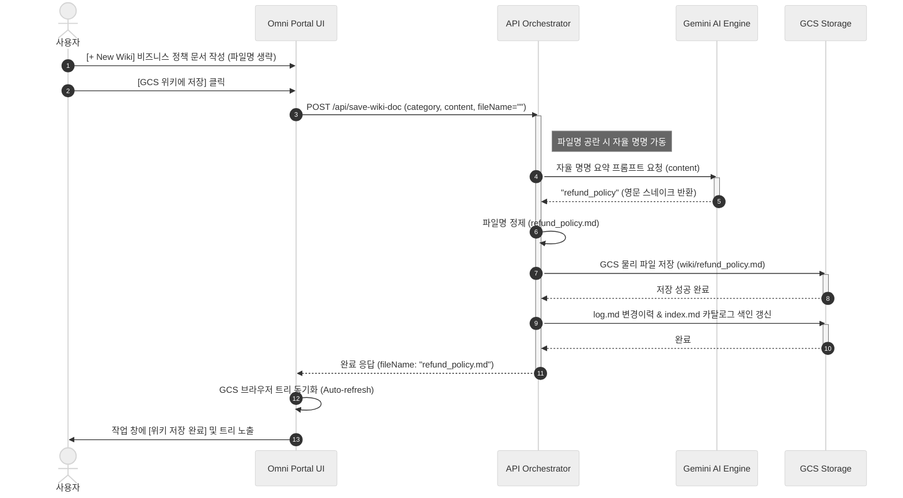
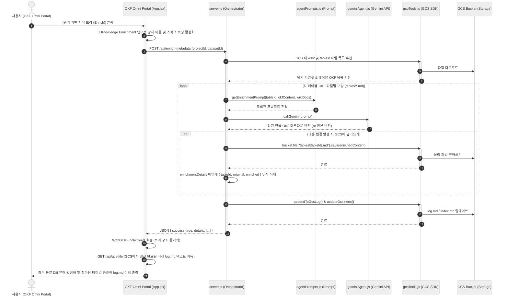
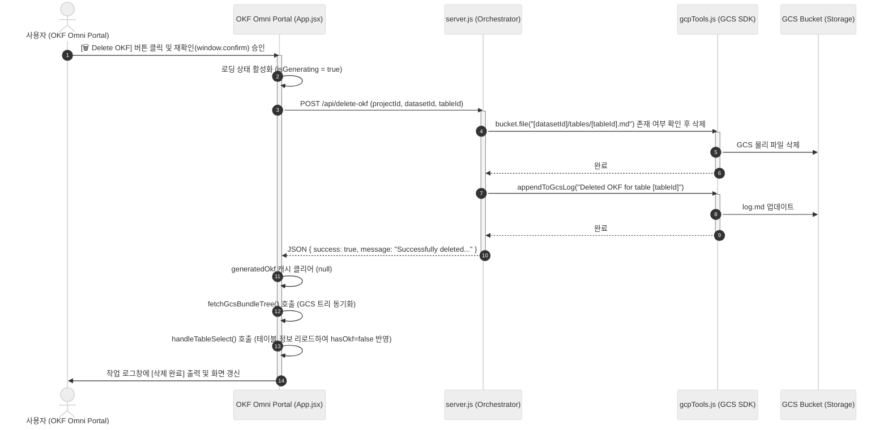

# OKF Omni 시스템 아키텍처 및 데이터 흐름도

본 문서는 정형 데이터(BigQuery)로부터 메타데이터를 추출하여 AI 비즈니스 지식 파일인 OKF(Ontology Knowledge File)로 변환하고, GCS(Google Cloud Storage) 내 비정형 위키 자산과 결합·보강하여 지식 허브를 구축하는 전체 데이터 파이프라인 흐름과 핵심 아키텍처를 기술합니다.

---

## 1. 통합 아키텍처 및 정형/비정형 순환 플로우 (Integrated Architecture & Semantic Loop)

본 플랫폼은 정형 데이터베이스와 비정형 온톨로지 지식 저장소, 생성형 AI 에이전트를 유기적으로 연결하여 **정형-비정형 데이터 간의 순환식 지식 합성(Semantic Loop)**을 이루도록 설계되었습니다. 아래 다이어그램은 정형 데이터 영역(BigQuery)과 비정형 지식 영역(GCS)이 어떻게 포털 및 AI 에이전트를 중심으로 융합되는지 보여줍니다.

```mermaid
%%{init: {'theme': 'neutral'}}%%
flowchart TB
    %% 저장소 영역
    subgraph Storages ["💾 Data & Knowledge Storages"]
        BQ[("📊 BigQuery DB<br/>(Structured Source)")]
        
        subgraph GCS ["Google Cloud Storage Bucket"]
            OKF_Files["📂 tables/*.md<br/>(OKF 명세 마크다운)"]
            Wiki_Files["📂 wiki/*.md<br/>(비정형 기획/비즈니스 위키)"]
            Catalog_Index["📂 index.md & log.md<br/>(Knowledge Catalog 색인/로그)"]
        end
    end

    %% 포털 및 엔진 영역
    subgraph Portal_AI_Tier ["⚙️ Portal & AI Orchestration Area"]
        Portal["💻 OKF Omni Portal<br/>(React UI & Express Server)"]
        Gemini["✨ Gemini AI Engine<br/>(gemini-3.5-flash)"]
        
        subgraph Agents [" AI 에이전트 동작 모듈 "]
            MDCode["🤖 mdcode (OKF 생성)"]
            Enrich["🔮 Enrichment Agent (보강)"]
            NL2SQL["💬 Data Agent (자연어 질의)"]
        end
    end

    %% ------------------ 통합 데이터 흐름 (Unified Data Flow) ------------------
    
    %% 1. OKF 생성 흐름 (정형 -> 비정형 변환)
    BQ ===>|① 물리 스키마 & 표본 수집| Portal
    Portal --->|② OKF 생성 명령| MDCode
    MDCode <===>|③ 비즈니스 한글 매핑 및 맥락 분석| Gemini
    MDCode ===>|④ 1차 OKF 파일 저장| OKF_Files
    
    %% 2. 비정형 위키 등록 및 자율 명명
    Portal ===>|⑤ 비정형 기획/정책 위키 작성| Wiki_Files
    Wiki_Files -.->|⑥ 파일명 공란 시 본문 요약 분석| Gemini
    Gemini -.->|⑦ 영문 스네이크 파일명 지정| Portal
    
    %% 3. 비정형 지식 융합 및 보강 (Enrichment Loop)
    Portal --->|⑧ 보강 명령 트리거| Enrich
    Enrich <===|⑨ 기존 테이블 OKF 명세 로드| OKF_Files
    Enrich <===|⑨ 비정형 위키 본문 스캔| Wiki_Files
    Enrich <===>|⑩ 의미 합성 및 한국어 설명 보강| Gemini
    Enrich ===>|⑪ 보강된 최종 OKF 파일 업데이트| OKF_Files
    
    %% 4. 인덱스 및 로그 빌드
    OKF_Files -.->|⑫ 파일 변경 감지| Catalog_Index
    Wiki_Files -.->|⑫ 파일 변경 감지| Catalog_Index
    Catalog_Index ===>|⑬ 최신 카탈로그 정보 동기화| Portal

    %% 5. 자연어 질의 기반 데이터 조회 (NL2SQL Loop)
    Portal ===>|⑭ 사용자의 자연어 질문| NL2SQL
    NL2SQL <===|⑮ 보강된 최종 OKF 컨텍스트 참조| OKF_Files
    NL2SQL <===>|⑯ 질문 + 지식 기반 SQL 변환| Gemini
    NL2SQL ====>|⑰ 생성된 쿼리 실행| BQ
    BQ ====>|⑱ 실행 결과 데이터 반환| NL2SQL
    NL2SQL -->>|⑲ 최종 자연어 답변 요약| Portal

    %% --- 스타일 가이드 (하얀 컴포넌트 & 색상 포인트) ---
    classDef structured fill:#ffffff,stroke:#1a73e8,stroke-width:2px,color:#202124;
    classDef unstructured fill:#ffffff,stroke:#fbbc04,stroke-width:2px,color:#202124;
    classDef portal fill:#ffffff,stroke:#5f6368,stroke-width:2px,color:#202124;
    classDef agent fill:#ffffff,stroke:#34a853,stroke-width:2px,color:#202124;

    class BQ structured;
    class OKF_Files,Wiki_Files,Catalog_Index,GCS unstructured;
    class Portal,Portal_AI_Tier portal;
    class Gemini,MDCode,Enrich,NL2SQL,Agents agent;

    style Storages fill:#f8fafd,stroke:#d2e3fc,stroke-width:1px;
    style GCS fill:#ffffff,stroke:#ffe0b2,stroke-width:1px;
    style Portal_AI_Tier fill:#f8f9fa,stroke:#dadce0,stroke-width:1px;
```

### [핵심 아키텍처 원칙]
1. **정형-비정형 순환 지식 합성 (Semantic Loop)**: BigQuery 정형 데이터 ➔ 1차 OKF 생성 ➔ GCS 비정형 위키 보강(Enrichment) ➔ Data Agent 질의(NL2SQL/GQL) ➔ 위키 인사이트 보관의 선순환 체계 구축.
2. **이중 백링크 정밀 구분 (Dual-Link System)**: RDB 물리 외래키(FK) 조인 백링크(`🔗 RDB FK 백링크`)와 BigQuery Property Graph 에지 릴레이션 링크(`🕸️ Graph Edge 링크`)를 OKF 명세 내에서 명확히 분리·서식화하여 AI 쿼리 생성 정확도를 극대화.
3. **100% 진실성 기반 동적 참조 (Truthful Dynamic References)**: 고정 더미 폴백 데이터를 배제하고, 실제 쿼리 및 질의에서 사용된 OKF 백링크 테이블(`referencedTables`)과 비즈니스 위키 문서(`referencedDocs`)만 실시간 노출하며, 미참조 시 `⚪ 미참조 (None)` 상태를 명확히 노출.

### [데이터 유형별 영역 구분]
* **정형 데이터 영역 (Structured Data Area)**: 원천 데이터인 **BigQuery** 물리 테이블과 컬럼 구조, 그리고 데이터 분할/정렬 키 및 실제 표본 행들을 포함합니다. 시스템의 모든 메타데이터 추출의 근간이 됩니다.
* **비정형 지식 영역 (Unstructured Knowledge Area)**: **GCS(Google Cloud Storage)**에 보관되는 마크다운 지식 자산입니다. 시스템이 자동 생성한 테이블 명세서인 `OKF(tables/*.md)`와 사용자가 작성한 비즈니스 규칙/정의서인 `Wiki(wiki/*.md)`로 분리되어 관리되며, 이 둘이 융합되어 고도화된 지식 번들을 구축합니다.
* **포털 및 AI 오케스트레이터 영역 (Orchestration Area)**: React 기반의 사용자 브라우저 화면(`OKF Omni Portal`)과 NodeJS 백엔드, 그리고 백그라운드 파이썬 에이전트들이 위치합니다. **Gemini AI API**와 연동하여 사용자의 명세 요청과 자연어 질문을 해석하고 분기 처리하는 두뇌 역할을 담당합니다.

### [순환 파이프라인 단계별 해설 (Pipeline Workflow)]
1. **정형 스키마 및 샘플 수집**: 사용자가 온톨로지 생성을 요청하면, 포털 백엔드가 대상 BigQuery 테이블의 물리 스키마 정보와 대표 샘플 데이터(5~10행)를 수집합니다.
2. **비정형 메타데이터(OKF) 1차 생성**: `mdcode` 엔진이 수집된 정형 명세를 프롬프트로 변환하여 Gemini API에 전달하고, 번역된 한글 비즈니스 명칭과 용어 정의를 결합한 표준 OKF 마크다운 파일을 생성하여 GCS에 저장합니다.
3. **비정형 기획 위키(Wiki) 등록**: 사용자가 포털 화면을 통해 비즈니스 정책(예: 환불 정책, 할인 조건)을 위키 문서로 작성하여 GCS에 저장합니다. 파일명을 지정하지 않은 경우 Gemini가 본문 맥락을 분석해 적절한 스네이크 케이스 영문 파일명(예: `refund_policy.md`)을 추천합니다.
4. **비정형 지식 융합 및 자율 보강 (Semantic Enrichment Loop)**: 사용자가 보강을 트리거하면, `Enrichment Agent`가 GCS 내의 모든 테이블 OKF 명세서와 비정형 위키 문서를 상호 교차 대조합니다. 연관된 비즈니스 규칙이 발견되면 OKF 명세서에 비즈니스 산식이나 컬럼 의미 설명을 한국어로 융합 및 갱신(Overwrite)합니다.
5. **지식 기반 자연어 질의 및 정형 데이터 환원 (NL2SQL Loop)**: 사용자가 자연어로 질문을 던지면, `Data Agent`가 갱신된 비정형 OKF 지식 자산을 해석하여 정확한 BigQuery SQL로 번역해 실행합니다. 결과 데이터를 다시 자연어 형태로 가공하여 사용자에게 돌려줌으로써, 정형 데이터 조회 편의성을 극대화합니다.

### [핵심 아키텍처 컴포넌트 역할 해설]
* **⚙️ API Orchestration Layer (`server.js`)**: 
  * 본 시스템의 **중앙 제어 장치(Control Plane)**입니다. 사용자 브라우저의 요청을 접수하여, 로컬에 설치된 Python 기반의 `mdcode tool` 모듈을 자식 프로세스로 제어합니다.
  * 지식 자산 무결성을 위해 OKF 파일이 GCS에 정상 적재되거나 삭제되면, GCS SDK를 통해 `index.md` 및 `log.md` 구조화 인덱스를 동적으로 재조립하여 실시간 배포합니다.
* **🧠 Core Engines**:
  * **`mdcode tool`**: BigQuery 물리 구조와 데이터 샘플을 융합하여 온톨로지 프롬프트 화력으로 변환하는 지식 생성 코어 엔진입니다.
  * **`Data Agent`**: 자연어 질문을 접수해 Gemini와 협업하여 실시간 SQL로 컴파일하고 실행 결과를 자율 요약하는 대화형 에이전트 엔진입니다.
  * **`🔮 Enrichment Agent`**: 비정형 위키 지식과 정형 스키마의 융합을 책임지는 에이전트입니다. GCS의 `wiki/` 폴더 내 비정형 기획 문서를 자율 검색하여 관련 테이블의 OKF 설명 문맥을 고부가가치 정보로 갱신해 줍니다.


## 2. 데이터 생명주기 및 흐름도 (Data Lifecycle & Flow)

본 아키텍처 상에서 흐르는 물리 스키마 데이터와 비정형 비즈니스 지식이 어떻게 변환 및 융합(Enrich)되는지 그 데이터의 생명주기 관점의 흐름을 정리한 것입니다.

### A. 핵심 데이터 순환 루프 6단계 (Logical Data Flow)
1. **물리 데이터 추출**: 사용자가 특정 테이블을 지정하면, `mdcode tool`이 **`BigQuery`**로부터 물리 스키마 명세 및 데이터 표본(Sample Rows)을 추출합니다.
2. **1차 지식화 (OKF 생성)**: 추출된 물리 정보를 바탕으로 **`Gemini AI`**가 비즈니스 한글 용어 매핑 및 데이터 거버넌스(PII 검사)를 완료한 후 GCS 버킷에 **1차 OKF 파일(`tables/*.md`)**을 생성 저장합니다.
3. **비정형 지식(Wiki) 작성**: 사용자가 브라우저를 통해 사내 비즈니스 기획 정의서(Wiki)를 작성하여 GCS에 저장합니다. 파일명이 공란일 경우 Gemini가 문맥 요약 후 적절한 영문 파일명을 자동 부여합니다.
4. **자율 지식 보강 (Enrichment Loop)**: `Enrichment Agent`가 GCS 내의 위키 본문을 전수 조사하여 관련 테이블의 **OKF 파일(`tables/*.md`)**에 비즈니스 산식 및 부가 설명을 한국어로 융합/보강하여 덮어씁니다.
5. **카탈로그 인덱스 최신화**: 카탈로그 빌더가 파일 갱신을 감지하여 GCS의 구조 색인(`index.md`) 및 이력 변경 로그(`log.md`)를 동적으로 빌드하여 최신 **Knowledge Catalog** 상태를 유지합니다.
6. **지식 기반 자연어 질의 (NL2SQL Loop)**: 사용자가 자연어로 질문을 던지면, `Data Agent`가 **Knowledge Catalog**와 **보강된 최종 OKF 지식 파일**을 연계 참조하여 최적의 BigQuery SQL을 작성해 실행 및 결과를 요약 보고합니다.

### B. 시각 데이터 흐름 설계도 (Data Flow Blueprint)


---

## 3. 핵심 비지니스 시나리오

### 시나리오 A. GCS 기반의 LLM-Wiki 관리 및 자율 명명 (Wiki Creation & Auto-naming)
1. 사용자가 AI 분석 리포트를 **[Save to LLM-Wiki]** 하거나, GCS 브라우저에서 **`[+ New Wiki]`**를 클릭해 수동으로 비즈니스 규칙을 작성합니다.
2. 이때 **파일명 입력을 비워두면**, 백엔드 API가 **`Gemini AI API`**에 본문 텍스트를 전달하여 핵심 맥락을 요약하는 영문 스네이크 케이스 파일명(예: `cancel_fee_rules`)을 자율 추출합니다.
3. 정제된 안전한 파일명으로 `GCS SDK`를 통해 `gs://.../[dataset_id]/wiki/[category]/[file_name].md` 경로에 실시간 기록하며, 업로드 성공과 동시에 GCS Browser 트리가 자동 갱신(Auto-refresh)되어 리스트에 즉시 노출됩니다.

### 시나리오 B. 자율형 데이터 에이전트 대화 (NL2SQL)
* 사용자의 자연어 질문("지난달 주문 금액이 가장 높은 유저 5명은?")을 **`Data Agent`**가 접수합니다.
* Data Agent는 원천 스키마 정보를 **`Gemini API`**에 전달하여 실행 가능한 표준 SQL을 생성받은 뒤, **`BigQuery SDK`**를 통해 빅쿼리 데이터베이스에 직접 실행하여 응답 데이터를 도출하고 이를 다시 자연어로 요약해 화면에 뿌려줍니다.

### 시나리오 C. GCS 위키 기반 메타데이터 자율 보강 (Metadata Enrichment)
1. 사용자가 데이터셋 대시보드 화면에서 **`[🔮 위키 기반 지식 보강 (Enrich)]`** 버튼을 클릭하여 보강 파이프라인을 트리거합니다.
2. 시스템은 현재 GCS 브라우저가 위치한 데이터셋(예: `theLookCommerce`) 경로를 추적하여 해당 버킷 내부의 `wiki/` 폴더 내 모든 마크다운 지식 자산들을 스캔합니다.
3. **`Enrichment Agent`**가 활성화되어 테이블 스키마 및 기존 OKF 문서들과 위키의 비정형 문서를 매핑합니다.
4. 매핑된 비즈니스 용어 설명, 연산 공식 등을 기존 `gs://.../[dataset_id]/tables/[table_id].md` 파일의 설명란에 **한국어로 변역 및 합성(Enrich)**하여 덮어씁니다.
5. 보강 내역이 반영되면 `log.md` 변경 이력과 `index.md` 구조 색인이 자동으로 갱신 배포됩니다.

### 시나리오 D. GCS 기반 OKF 명세 물리 삭제 (Delete OKF)
1. 사용자가 특정 테이블 명세가 잘못 되었거나 불필요하다고 판단하는 경우, 테이블 상세 헤더의 **`[🗑️ Delete OKF]`** 버튼을 클릭합니다.
2. 경고 팝업을 확인 및 수락하면, 백엔드 `/api/delete-okf` API를 통해 GCS 버킷 내 물리 파일(`gs://.../tables/[table_id].md`)이 즉시 삭제됩니다.
3. 삭제 이력은 `log.md` 파일에 저장 기록(Append)되며, 프론트엔드의 GCS 탐색기 트리가 최신 상태로 새로고침(Auto-refresh)되고 테이블의 생성 상태가 `Delete` 상태로 복구됩니다.

---

## 4. 코드 구조 및 내부 제어 흐름 (Code Structure & Control Flow)

본 시스템은 정밀한 역할 격리(Decoupling) 모델을 따릅니다. 사용자의 액션이 프론트엔드(`App.jsx`)에서 시작되어 백엔드 컨트롤러(`server.js`)를 거치고, 프롬프트(`agentPrompts.js`), AI 연산(`geminiAgent.js`), GCS 연동(`gcpTools.js`) 레이어로 오케스트레이션되는 상세 내부 제어 흐름을 정의합니다.

특히, 에이전트 실행의 투명성을 보장하기 위해 모든 실행 흐름은 **[좌측 결과창(60%) & 우측 실행 추론창(40%)] 분할 레이아웃 표준 UI**로 정형화하여 가시화합니다:
* **OKF 생성 (`mdcode` 실행)**: 백엔드에서 파이썬 `reference_agent` 구동 시 발생한 터미널 콘솔 출력(`stdout`)을 통째로 캡처하여 프론트엔드의 `mdcode Console Log` 터미널 뷰어로 연동합니다.
* **지식 보강 (`Enrichment` 실행)**: Gemini 3.5 Flash의 `thinkingConfig`를 활용하여 추출해낸 **AI의 자율 생각 흐름(`thoughts`)**과 실제 메모리 상에서 조립되어 전송된 **조립 프롬프트 전문**을 우측 추론 추적 패널에 실시간 매핑하여 투명하게 제공합니다.

### A. 비즈니스 정의서(Wiki) 업로드 및 AI 자율 명명 흐름 (Wiki Upload & Auto-Naming)


### B. 위키 지식 기반 메타데이터 자율 보강 및 리포트 렌더링 흐름 (Metadata Enrichment & Diff Reporting)


### C. OKF 명세 물리 삭제 흐름 (OKF Deletion Flow)


---

## 5. OKF (Ontology Knowledge File) 표준 스펙 구조

`mdcode tool`을 거쳐 생성되는 OKF 산출물은 LLM 및 AI 에이전트가 데이터셋을 정확하게 이해할 수 있도록 마크다운 포맷으로 조판되며, 다음과 같은 정밀 규격을 따릅니다:

### A. YAML Frontmatter (헤더 메타데이터)
문서 최상단에 검색 및 인덱싱을 위한 전역 메타데이터가 선언됩니다.
```yaml
---
table_name: "users"                      # 원천 물리 테이블명
logical_name: "사용자 마스터 정보"         # 표준 용어 기반의 한글 물리명
dataset_id: "theLookCommerce"            # 소속 데이터셋 ID
description: "쇼핑몰 가입 회원의 기본 프로필, 이메일, 가입 경로 및 세그먼트 분류를 담은 핵심 마스터 테이블"
pii_contained: true                      # 개인정보(PII) 포함 여부
security_level: "Restricted"             # 보안 분류 등급 (Public / Internal / Restricted)
---
```

### B. Columns Specification (컬럼 상세 명세 테이블)
컬럼들의 물리 구조, 데이터 타입과 함께 비즈니스 논리명과 거버넌스 정보가 유기적으로 결합된 표 형태의 명세입니다.
* **Physical Name**: 물리 컬럼명 (예: `id`, `created_at`)
* **Type**: 빅쿼리 물리 데이터 타입 (예: `INT64`, `TIMESTAMP`)
* **Logical Name**: 사내 표준 사전에 기반하여 정제된 한글 표준 논리명 (예: `사용자 ID`, `가입 일시`)
* **Description**: 컬럼의 구체적 쓰임새 및 비즈니스 산식 해설 (예: `회원 가입이 승인되어 DB에 적재된 시각. UTC 기준.`)
* **PII**: 개인정보 여부 (`Yes` / `No`)

### C. Semantic Relationships (의미론적 관계망 정보)
테이블 간의 물리적 외래키(FK) 정보가 부재하더라도, AI가 자율 조인(Join)을 수행할 수 있도록 의미적 연관 컬럼을 정의합니다.
* 예: `orders.user_id` ➔ `users.id` (1:N 연관 관계 명시)
* 예: `order_items.product_id` ➔ `products.id` (N:1 참조 관계 명시)
