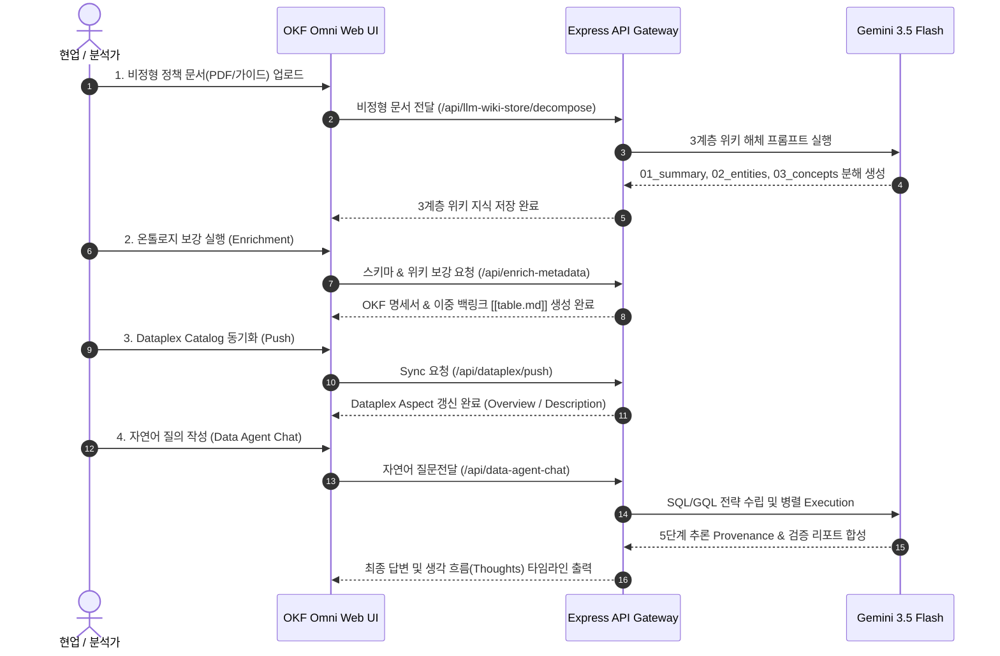

# 📘 OKF Omni 사용자 가이드 (User Guide)

**OKF Omni (Enterprise Ontology & Intelligent Data Agent Platform)**에 오신 것을 환영합니다!
본 가이드는 사내 데이터 관리자, 데이터 엔지니어, 비즈니스 분석가(BA)가 비정형 비즈니스 문서와 BigQuery 물리 스키마를 유기적으로 연결하고, 지능형 대화(RAG)를 통해 비즈니스 인사이트를 도출하는 가이드를 제공합니다.

---

## 🧭 목차 (Table of Contents)
1. [플랫폼 개요](#1-플랫폼-개요)
2. [핵심 기능 및 메인 탭 활용법](#2-핵심-기능-및-메인-탭-활용법)
   - [🤖 1. Agent Evolution Studio (지능형 대화 & Provenance)](#-1-agent-evolution-studio-지능형-대화--provenance)
   - [📄 2. OKF Knowledge Store (3계층 위키 & 명세 관리)](#-2-okf-knowledge-store-3계층-위키--명세-관리)
   - [⚙️ 3. BigQuery & Spanner Graph (프로퍼티 그래프 Visualizer)](#-3-bigquery--spanner-graph-프로퍼티-그래프-visualizer)
   - [🎙️ 4. Ingestion & Interview Feedback (비정형 해체 & 피드백 주입)](#-4-ingestion--interview-feedback-비정형-해체--피드백-주입)
   - [📊 5. Provenance & Tokenomics (품질 & 비용 감사)](#-5-provenance--tokenomics-품질--비용-감사)
3. [단계별 사용자 워크플로우](#3-단계별-사용자-워크플로우)
4. [자주 묻는 질문 (FAQ)](#4-자주-묻는-질문-faq)

---

## 1. 플랫폼 개요

OKF Omni는 Enterprise Data & Knowledge를 아우르는 온톨로지 기반 지식 플랫폼입니다.
- **물리 스키마 보강**: BigQuery DDL/스키마 정보에 비정형 가이드라인을 결합하여 컬럼 및 테이블 명세를 강화합니다.
- **프로퍼티 그래프 자동 빌드**: 노드(Node) 및 에지(Edge) 관계를 BigQuery Property Graph DDL 및 GQL(`GRAPH_TABLE`) 형태로 자동 변환합니다.
- **5단계 추론 Provenance**: AI가 어떤 질문에 답변할 때 SQL 쿼리, GQL 그래프 관계, 위키 인용 근거를 투명하게 공개합니다.

---

## 2. 핵심 기능 및 메인 탭 활용법

### 🤖 1. Agent Evolution Studio (지능형 대화 & Provenance)
- **자연어 질의 (Data Agent Chat)**:
  "지난달 이탈 가능성이 높은 악성 고객 리스트와 이들이 주로 구매한 상품 카테고리를 알려줘" 와 같은 복합 질문을 입력합니다.
- **하이브리드 추론 엔진**:
  AI가 Standard SQL(RDB 데이터 조회)과 GQL(`GRAPH_TABLE` 프로퍼티 그래프 연관 탐색)을 자율적으로 선택하고 수행합니다.
- **답변 진화 타임라인 (Stage 1 ~ 4)**:
  - **Stage 1 (Vanilla RAG)**: 기본 문서 검색 답변
  - **Stage 2 (OKF Injected)**: 사내 정책 규칙이 반영된 답변
  - **Stage 3 (Physical Graph Bound)**: 데이터베이스 실제 조인 결과가 반영된 답변
  - **Stage 4 (Refined Feedback)**: 현업 피드백 및 예외 룰이 최종 적용된 검증 보고서
- **실시간 추론 추적 (Thought Stream)**:
  우측 패널에서 Gemini AI의 자율 생각 흐름(`Thoughts`)을 실시간 확인 가능합니다.

---

### 📄 2. OKF Knowledge Store (3계층 위키 & 명세 관리)
- **3계층 위키 뷰어**:
  - `01_summary/`: 비즈니스 배경 및 개요 요약
  - `02_entities/`: 데이터 용어 및 물리 테이블 매핑 사전
  - `03_concepts/`: 현업 정책, 업무 규칙 및 예외 처리 가이드
- **OKF 마크다운 스펙 편집 & 백링크 (`[[table.md]]`)**:
  테이블 간 물리/논리 관계를 이중 백링크 형태로 자동 생성하고 편집할 수 있습니다.
- **Dataplex Catalog 동기화 (Push)**:
  보강된 OKF 지식을 버튼 한 번으로 Google Dataplex Data Catalog의 Overview/Description Aspect로 반영합니다.

---

### ⚙️ 3. BigQuery & Spanner Graph (프로퍼티 그래프 Visualizer)
- **Graph DDL 자동 생성**:
  `CREATE PROPERTY GRAPH` 구문을 자동 생성하여 노드(Entity)와 에지(Relationship)의 토폴로지를 시각적 다이어그램으로 조회합니다.
- **Graph Explorer**:
  BigQuery 표준 GQL 구문과 함께 인터랙티브 노드-에지 뷰어로 데이터 관계를 탐색합니다.

---

### 🎙️ 4. Ingestion & Interview Feedback (비정형 해체 & 피드백 주입)
- **비정형 문서 업로드 & 위키 해체**:
  PDF, 텍스트 형태의 정책/가이드라인 문서를 드래그 앤 드롭으로 업로드하면 AI가 3계층 위키로 자동 분해합니다.
- **인터뷰 & CS 음성 캡처 (Autopilot)**:
  현업 담당자와의 인터뷰 녹음이나 대화 내용을 텍스트화하여 온톨로지에 즉각 반영합니다.
- **현업 예외 규칙 피드백 (Feedback Loop)**:
  특수 상황(예: "VIP 고객 환불 처리 시 전결 기준 예외 건")을 피드백으로 입력하여 온톨로지에 피드백 룰셋으로 합성합니다.

---

### 📊 5. Provenance & Tokenomics (품질 & 비용 감사)
- **토크노믹스 (Token Savings)**:
  OKF 3계층 인덱스 및 그래프 구조 적용으로 프롬프트 토큰 사용량이 최대 76% 절감되는 현황을 모니터링합니다.
- **Citation 감사 추적 (100% Provenance)**:
  모든 AI 답변의 출처(테이블명, SQL, 위키 문서 라인)를 인용구 형태로 검증합니다.

---

## 3. 단계별 사용자 워크플로우

---

## 4. 자주 묻는 질문 (FAQ)

- **Q1. BigQuery에 Table 외에 VIEW 개체가 포함되어 있으면 에러가 발생하나요?**
  - **A**: 아니오. OKF Omni는 VIEW 개체 조회 시 `table.getRows()` 대신 방어적 Direct SQL Fallback(`SELECT * FROM view LIMIT 10`) 및 예외 처리가 내장되어 있어 백화 현상이나 에러 없이 동작합니다.

- **Q2. Dataplex 동기화 시 CLI 응답이 늦어지면 UI가 먹통이 되나요?**
  - **A**: 아니오. 3초 타임아웃 및 10분 TTL 인메모리 캐시 시스템이 구축되어 있어 항상 초고속 메타데이터 응답을 제공합니다.

- **Q3. 언어를 영어(EN)로 변경하고 싶으면 어떻게 하나요?**
  - **A**: 상단 헤더의 언어 스위치 토글(🇺🇸 EN / 🇰🇷 KO)을 조작하면 최종 Agent 리포트 및 UI가 선택 언어로 자동 도출됩니다.
