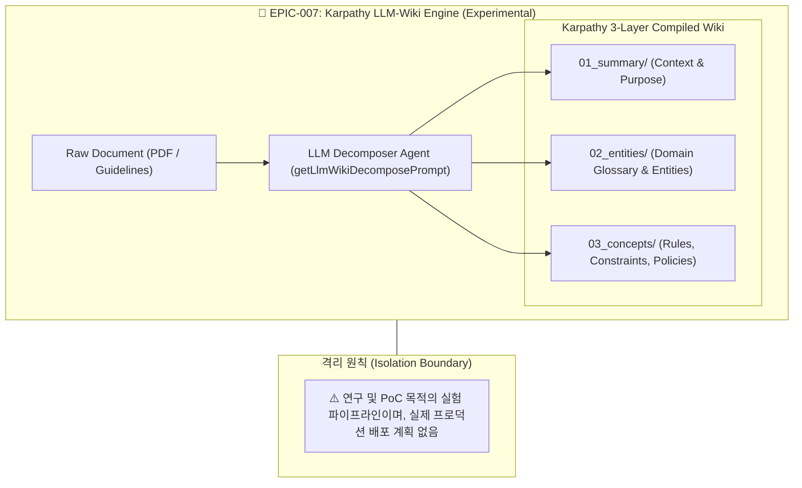

# 🧪 [EPIC-007] [EXPERIMENTAL] Andrej Karpathy-Style LLM-Wiki Knowledge Compiler Engine

## 1. 개요 및 실험 목적 (Epic Overview)
* **Epic ID**: `EPIC-007`
* **대칭 Task**: [`TASK-007` (Experimental Karpathy LLM-Wiki)](file:///Users/seanjung/.gemini/antigravity-demo-archive/antigravity-demo-2026-8-2-118/scratch/ontology-with-okf/documents/05_experimental/TASK-007_EXPERIMENTAL_KARPATHY_LLM_WIKI.md)
* **상태**: 🧪 **`Experimental / Research Only` (실제 프로덕션 적용 계획 없음)**
* **연구 목적**: Andrej Karpathy가 제안한 'LLM OS & LLM-Wiki' 개념을 기반으로 비정형 비즈니스 문서를 3계층(`01_summary`, `02_entities`, `03_concepts`)으로 자율 해체·컴파일하는 독립적인 **실험적 지식 컴파일러 파이프라인의 가능성을 연구·검토**합니다.
* **상위 연계 문서**: [`prod.md`](file:///Users/seanjung/.gemini/antigravity-demo-archive/antigravity-demo-2026-8-2-118/scratch/ontology-with-okf/prod.md), [`AGENT.md`](file:///Users/seanjung/.gemini/antigravity-demo-archive/antigravity-demo-2026-8-2-118/scratch/ontology-with-okf/AGENT.md)
* **참조 연구 문서**:
  * [`documents/01_architecture/KARPATHY_LLM_WIKI_GUIDE.md`](file:///Users/seanjung/.gemini/antigravity-demo-archive/antigravity-demo-2026-8-2-118/scratch/ontology-with-okf/documents/01_architecture/KARPATHY_LLM_WIKI_GUIDE.md)
  * [`documents/01_architecture/LLM_WIKI_ENGINE_SPECIFICATION.md`](file:///Users/seanjung/.gemini/antigravity-demo-archive/antigravity-demo-2026-8-2-118/scratch/ontology-with-okf/documents/01_architecture/LLM_WIKI_ENGINE_SPECIFICATION.md)

---

## 2. 실험적 연구 범위 및 아키텍처 (Experimental Scope)

본 Epic은 실제 온톨로지 보강 파이프라인([`EPIC-003`](file:///Users/seanjung/.gemini/antigravity-demo-archive/antigravity-demo-2026-8-2-118/scratch/ontology-with-okf/documents/03_epics/EPIC-003_WIKI_UNSTRUCTURED_DOC_TRANSPILER.md))과 완전히 분리된 **연구/프로토타입 전용 영역**입니다.

### 주요 연구 주제:
1. **자율 3계층 위키 해체 (3-Layer Autonomous Decomposition)**:
   - 비정형 긴 문서를 요약(Summary), 엔터티(Glossary), 규칙(Concepts) 단위 마크다운으로 무손실 분해할 수 있는지의 타당성 검증.
2. **지식 베이스 자체 진화 메커니즘**:
   - 신규 문서 유입 시 기존 위키와의 충돌 감지 및 자율 병합(Conflict Resolution) 알고리즘 연구.
3. **토큰 및 신선도 관리 연구**:
   - 거대 문서의 점진적 위키화 시 토큰 소비량 절감률 및 Karpathy LLM-Wiki 패턴의 장단점 평가.

---

## 3. 실험 평가 기준 및 상태 (Evaluation Criteria)
- **현재 상태**: 개념 연구 및 프로토타입 검토 단계 (`Exploration Stage`).
- **프로덕션 적용 여부**: **`적용 계획 없음 (No Production Rollout Planned)`**
- **평가 지표**:
  - [x] 3계층 위키 마크다운 분해 알고리즘 프로토타입 작성 완료.
  - [x] 실험용 GCS 저장소(`/api/llm-wiki-store/decompose`) 연동 가능성 검증.
  - [ ] 향후 실제 필요성 대두 시 정식 프로덕션 연계 여부 재검토.
